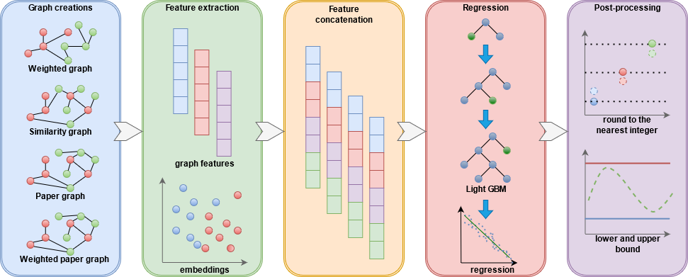

# ALTEGRAD Challenge: H Index Prediction
**Team BVM :**

* Bertrand PATUREL
* Vanessa CHAHWAN 
* Martin BRICENO 

<p align="center">
  
</p>

# Description
The treatment of data structures such as graphs and text is a long and complex process considering that there are several methods to extract features fromthem and that it is not easy to know which of theseare suitable for a subsequent task such as classification or regression.
In this repository we will show our methods to extract features  made  in  our  H-index  prediction  process. We will also show the rest of the prediction chain such as regression and post processing. Finally, this treatment allowed us to be in 2nd place on the public leaderboard with a difference of 0.028 in score from the first place.

# Project's goal

H-index  is  an  indicator  suggested  in  2005  by  Jorge  Hirsch with the objective of characterizing the quality, relevance and quantifying the scientific production of a researcher. 
This indicator depends on two parameters:
- The number of articles published by the researcher
- The number of citations of each article

A scientist has "index h if h of his or her Np papers have at least h citations each and the other (Np-h) papers have h citations each"

The main purprose of this project is to predict the h-index given:
- A graph indicating which authors have published a paper together.
- The abstracts of several papers in a database.

# Main Model
<p align="center">
  
</p>


# Getting started
## Required files

Before running the model it is advisable to download some files necessary for its execution. This will save you time since the creation of networks and the extraction of some features is very slow. Here is the download link:

> www.kaggle.com/dataset/def482c59cd5a8ec65e48fef7a67002640d742dfd0e8a389b86421e28356171a

Once downloaded, deposit these files in the ```/data/``` folder.

## Run our model

To execute our model you have to run the following line in the "code" folder.


> ```python paper_representations.py```

> ```python author_representations.py```

> ```python create_graphs.py```

> ```python papers_features.py```

> ```python graph_features.py```

> ```python node2vec.py```

> ```python author_node2vec.py```

> ```python preprocessing_node2vec.py```

> ```python model.py```

**If you have downloaded the files from the previous step you only need to execute the last command, the rest is no longer necessary.**

<p align="center">
  
</p>
